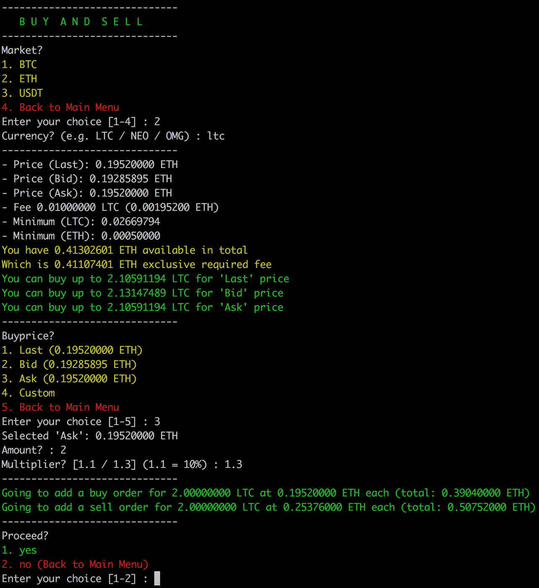
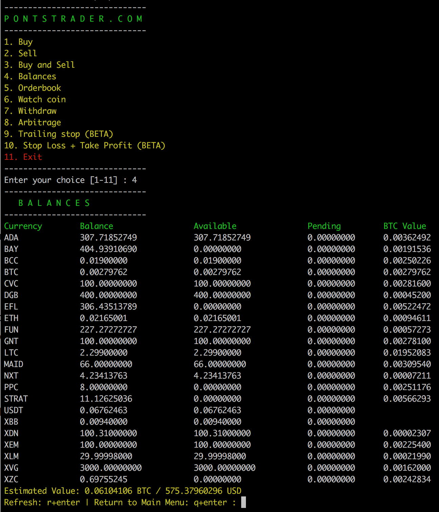
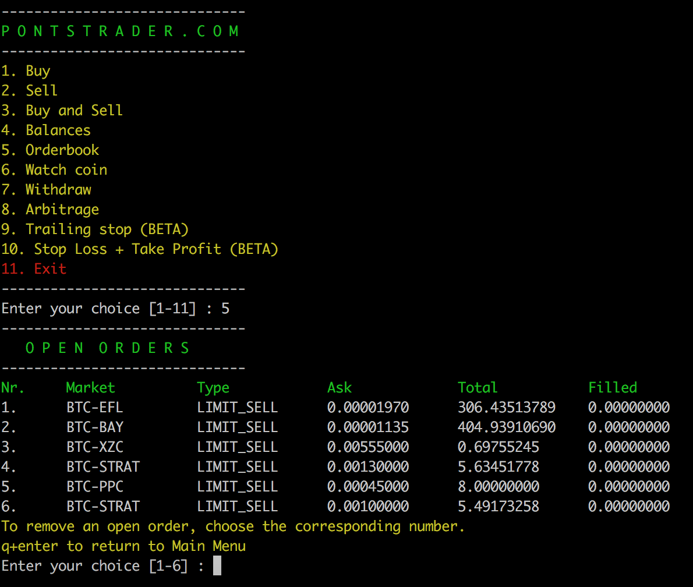
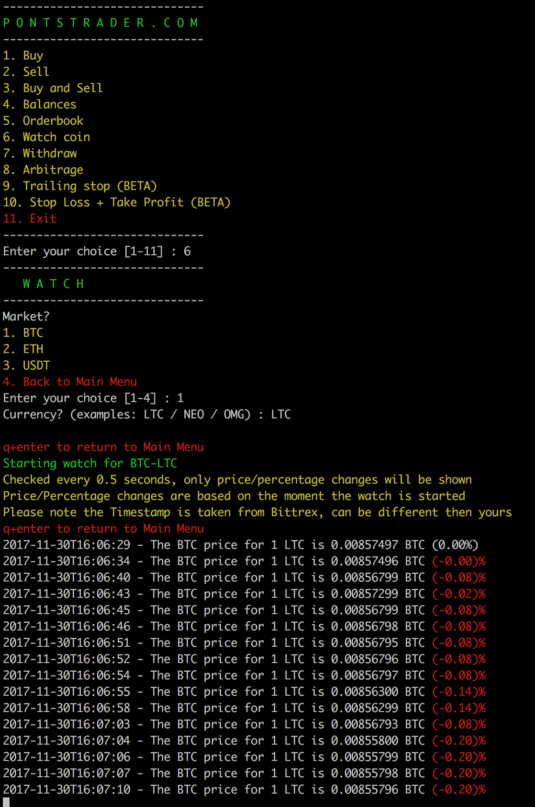

# pontstrader

pontstrader is a trading script running on python2.7 which adds some extra features to the default Bittrex trading possibilities trough the Bittrex webinterface.

Due to it being written in Python, it can run on any device such as: Windows, Mac, Linux, Raspberry Pi, Phone and NAS.

Index:
  - Features (This page)
  - [Installation](doc/Installation.md)
  - [Upgrade version or re-configure](doc/Upgradereconfigure.md)
  - [Releasenotes](doc/Releasenotes.md)

Join us on Telegram for more information or if you would like to purchase pontstrader for just 10 dollar:
https://t.me/pontstrader

## What can users do with pontstrader

1. Buy cryptocurrencies (Bittrex)
2. Sell cryptocurrencies (Bittrex)
3. Buy cryptocurrencies and immidiatly add a sell order with a multiplier (Bittrex)
4. Check their balances (Bittrex)
5. Check their orderbook (Bittrex)
6. Watch a cryptocurrencies in real-time 0.5 seconds (Bittrex)
7. Withdraw cryptocurrencies (Bittrex)
8. Check arbitrage oppertunaties between exchanges (Bittrex, HitBTC, Binance, Bitfinex, Poloniex)
9. Use Trailing Stop Loss, which is normally not possible on most exchanges (Bittrex)

Some of the above functions require the script to run on a system which is on 24/7, this is due to the fact the script is actively (every 0.5 seconds) quering the pontstrader redis database for price changes.
Currently the following functions require a 24/7 running system:

- Trailing Stop Loss

## What can users expect from pontstrader in the near future

1. Stop Loss + Take Profit function which allows you to set not just one but multiple tresholds, which means the script will not only sell when it hits your stop loss treshold but will also sell when it hits your profit tresholds. Normally you can only choose one on Bittrex. (this will also require a 24/7 running system)
2. Stop Loss + Take Profit multiple sell tresholds. Same as the above, but then a 50/50 split in selling tresholds. For example you want to sell 50% at 5% profit, and the other 50% at 10%. (this will also require a 24/7 running system)
3. Multiple exchange support on every function, currently only Bittrex is supported on most of them
4. And much more!

Join us on Telegram for more information or if you would like to purchase pontstrader for just 10 dollar:
https://t.me/pontstrader

## Features

#### 1. Buy
The buy function allows you to buy any coin on any market supported on the Bittrex exchange.
  - Choose a market (BTC, ETH or USDT)
  - Choose a currency such as NEO, LTC or LSK
  - Price information will be shown, also shows you how much you can buy at current Last, Ask and Bid rates
  - You are asked to choose to buy for Last, Ask, Bid or Custom
  - Choose the amount you would like to buy
  - Recheck your input and confirm the buy if everything looks find

  

#### 2. Sell
The sell function allows you to sell any coin on any market supported on the Bittrex exchange.
  - Upon starting this function your balances will be checked.
  - Choose the currency by providing its corresponding number.
  - Choose the market where you would like to sell the coin on (Make sure the market exists).
  - Price information will be shown
  - You are asked to choose to sell for Last, Ask, Bid or Custom
  - Choose the amount you would like to sell
  - Recheck your input and confirm the sell if everything looks find

#### 3. Buy and Sell
The buy and sell function allows you to buy any coin on any market supported on the Bittrex exchange, after buying create a sell order with a multiplier
  - Choose a market (BTC, ETH or USDT)
  - Choose a currency such as NEO, LTC or LSK
  - Price information will be shown, also shows you how much you can buy at current Last, Ask and Bid rates
  - You are asked to choose to buy for Last, Ask, Bid or Custom
  - Choose the amount you would like to buy
  - Choose the multiplier (1.1 = 10%)
  - Recheck your input and confirm the buy if everything looks find
  - The script will buy your currency, and create a sell order after the buy is completed

#### 4. Balances
The balances function is pretty straight forward, it shows all your balances upon starting it as you can see on this screenshot below.

#### 5. Orderbook
The orderbook function is pretty straight forward, it shows all your open orders upon starting it as you can see on this screenshot below.

#### 6. Watch
The watch function allows you to watch a coin in real-time, quering the pontstrader redis database server every 0.5 for price updates. Only price changes are shown, check the screenshot.

#### 7. Withdraw
The withdraw function allows you to withdraw coins towards other wallets, also pretty straight forward and easy to use.
Dont forget to add a Payment ID if required.

#### 8. Arbitrage
The arbitrage function allows you to show price differences between 5 different exchanges, currently supported exchanges are:
Bittrex, HitBTC, Binance, Bitfinex and Poloniex
  - You can choose to show oppertunaties only from a specific market
  - You can choose to show oppertunaties only from a specific exchange

#### 9. Trailing Stop Loss
The trailing stop loss function allows you to trade currencies on a more advanced matter, if you do not know what trailing stop loss is please have a look at: https://www.investopedia.com/articles/trading/08/trailing-stop-loss.asp

Upon selling a coin, either with loss or profit... a push notification will be send towards your phone if you've enabled pushover or pushbullet (which is awesome btw!)

Please keep in mind this function requires the system running this to be on 24/7, because this script will look for price differences every 0.5 seconds and is not able to do this when its not on. A recommendation will be a power efficient raspberry pi with for example Raspbian, you can run pontstrader is a screen or tmux session.

Small example:
If you set a trailing stop loss treshold to 10% your trade will immidiatly be sold when it falls 10% straight away, but if it climbs to 5% profit and afterwards falls 10% it will stop at -5% instead of minus 10%, this results in less loss.
If the price starts climbing and it goes towards 20%, the trailing stop loss will be set to 10%. When it starts falling it will sell on 10% which results in less risk and restless sleep for you :)

Join us on Telegram for more information or if you would like to purchase pontstrader for just 10 dollar:
https://t.me/pontstrader
