

  

pontstrader is a trading script running on python2.7 which adds some extra features to the default Bittrex trading possibilities trough the Bittrex webinterface.

Due to it being written in Python, it can run on any device such as: Windows, Mac, Linux, Raspberry Pi, Phone and NAS.

!!! PONTSTRADER IS NOT AN AUTOMATED TRADING BOT !!!

!!! This script is here to help you with your trades, we are not responsible for losses !!!

!!! This script is not usable if you have no subscription, unless you are able to create your own backend with the public ticker data, feel free to do so !!!

Join us on Telegram for more information or if you would like to purchase pontstrader for just 10 dollar:
https://t.me/pontstrader

Index:
  - [Features](#features)
  - [Installation](docs/Installation.md)
  - [Upgrade version or re-configure](docs/Upgradereconfigure.md)
  - [Releasenotes](docs/Releasenotes.md)

## What can users do with pontstrader

1. Buy cryptocurrencies (Bittrex)
2. Sell cryptocurrencies (Bittrex)
3. Buy cryptocurrencies and immidiatly add a sell order with a multiplier (Bittrex)
4. Check their balances (Bittrex)
5. Check their orderbook (Bittrex)
6. Watch a cryptocurrencies in real-time 0.5 seconds (Bittrex)
7. Withdraw cryptocurrencies (Bittrex)
8. Check arbitrage oppertunaties between exchanges (Bittrex, HitBTC, Binance, Bitfinex, Poloniex)
9. Use Trailing Stop Loss, which is normally not possible on most exchanges (Bittrex)
10. Take Profit function that sells on configured target and sends push notification (Bittrex)
11. Stop Loss + Take Profit creates both stop loss and take profit targets at once (Bittrex)
12. Trailing + Take Profit same as function 9 but only sells in profit (Bittrex)

Some of the above functions require the script to run on a system which is on 24/7, this is due to the fact the script is actively (every 0.5 seconds) quering the pontstrader redis database for price changes.
Currently the following functions require a 24/7 running system:

- Trailing Stop Loss
- Take Profit
- Stop Loss + Take Profit
- Trailing Take Profit

## What can users expect from pontstrader in the near future

3. Multiple exchange support on every function, currently only Bittrex is supported on most of them
4. And much more!

Join us on Telegram for more information or if you would like to purchase pontstrader for just 10 dollar:
https://t.me/pontstrader

## Features

#### 1. Buy
The buy function allows you to buy any coin on any market supported on the Bittrex exchange.
  - Choose a market (BTC, ETH or USDT)
  - Choose a currency such as NEO, LTC or LSK
  - Price information will be shown, also shows you how much you can buy at current Last, Ask and Bid rates
  - You are asked to choose to buy for Last, Ask, Bid or Custom
  - Choose the amount you would like to buy
  - Recheck your input and confirm the buy if everything looks find
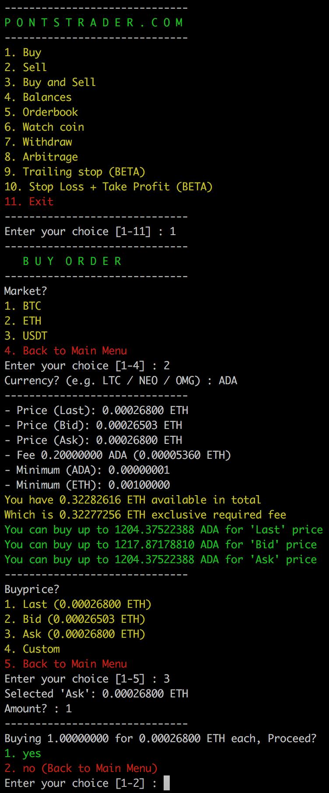

  

#### 2. Sell
The sell function allows you to sell any coin on any market supported on the Bittrex exchange.
  - Upon starting this function your balances will be checked.
  - Choose the currency by providing its corresponding number.
  - Choose the market where you would like to sell the coin on (Make sure the market exists).
  - Price information will be shown
  - You are asked to choose to sell for Last, Ask, Bid or Custom
  - Choose the amount you would like to sell
  - Recheck your input and confirm the sell if everything looks find
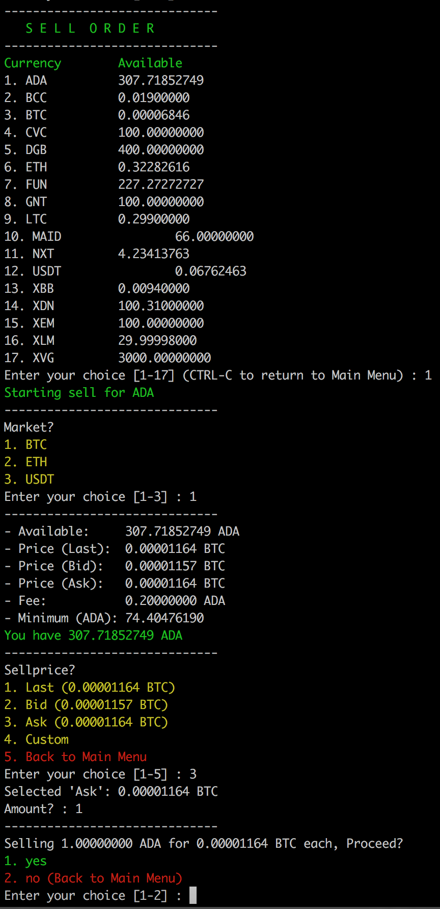

#### 3. Buy and Sell
The buy and sell function allows you to buy any coin on any market supported on the Bittrex exchange, after buying create a sell order with a multiplier
  - Choose a market (BTC, ETH or USDT)
  - Choose a currency such as NEO, LTC or LSK
  - Price information will be shown, also shows you how much you can buy at current Last, Ask and Bid rates
  - You are asked to choose to buy for Last, Ask, Bid or Custom
  - Choose the amount you would like to buy
  - Choose the multiplier (1.1 = 10%)
  - Recheck your input and confirm the buy if everything looks find
  - The script will buy your currency, and create a sell order after the buy is completed

#### 4. Balances
The balances function is pretty straight forward, it shows all your balances upon starting it as you can see on this screenshot below.

#### 5. Orderbook
The orderbook function is pretty straight forward, it shows all your open orders upon starting it as you can see on this screenshot below.

#### 6. Watch
The watch function allows you to watch a coin in real-time, quering the pontstrader redis database server every 0.5 for price updates. Only price changes are shown, check the screenshot.

#### 7. Withdraw
The withdraw function allows you to withdraw coins towards other wallets, also pretty straight forward and easy to use.
Dont forget to add a Payment ID if required.

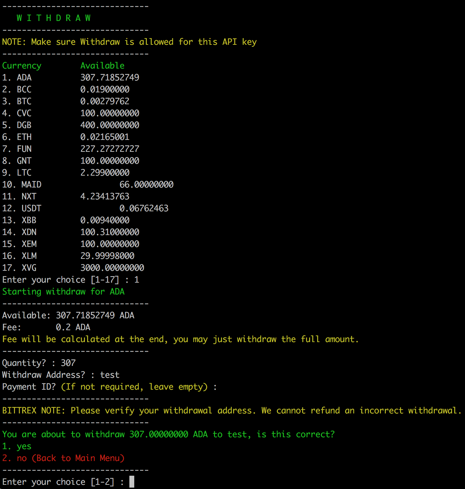

#### 8. Arbitrage
The arbitrage function allows you to show price differences between 5 different exchanges, currently supported exchanges are:
Bittrex, HitBTC, Binance, Bitfinex and Poloniex
  - You can choose to show oppertunaties only from a specific market
  - You can choose to show oppertunaties only from a specific exchange

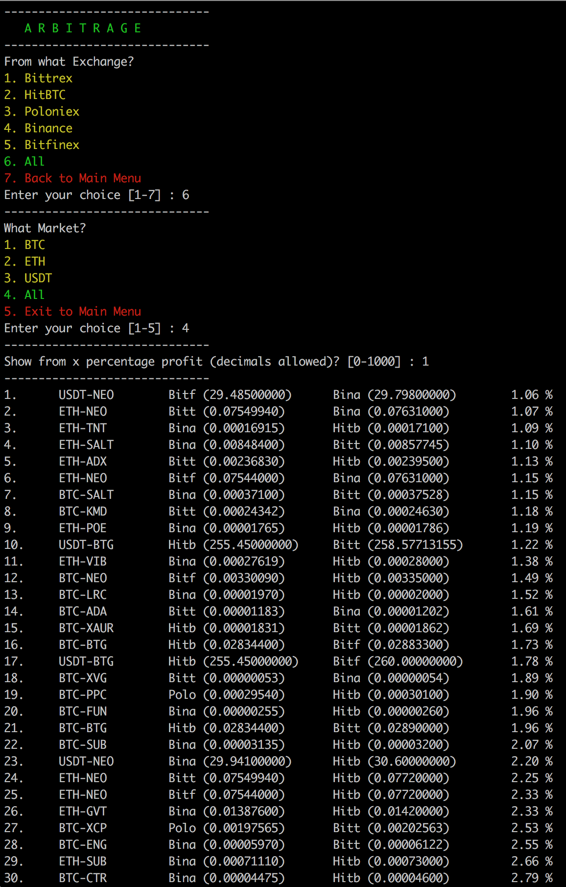

#### 9. Trailing Stop Loss (Requires 24/7 running device)
The trailing stop loss function allows you to trade currencies on a more advanced matter, if you do not know what trailing stop loss is please have a look at: https://www.investopedia.com/articles/trading/08/trailing-stop-loss.asp

Upon selling a coin, either with loss or profit... a push notification will be send towards your phone if you've enabled pushover or pushbullet (which is awesome btw!)

Please keep in mind this function requires the system running this to be on 24/7, because this script will look for price differences every 0.5 seconds and is not able to do this when its not on. A recommendation will be a power efficient raspberry pi with for example Raspbian, you can run pontstrader is a screen or tmux session.

Small example:
If you set a trailing stop loss treshold to 10% your trade will immidiatly be sold when it falls 10% straight away, but if it climbs to 5% profit and afterwards falls 10% it will stop at -5% instead of minus 10%, this results in less loss.
If the price starts climbing and it goes towards 20%, the trailing stop loss will be set to 10%. When it starts falling it will sell on 10% which results in less risk and restless sleep for you :)

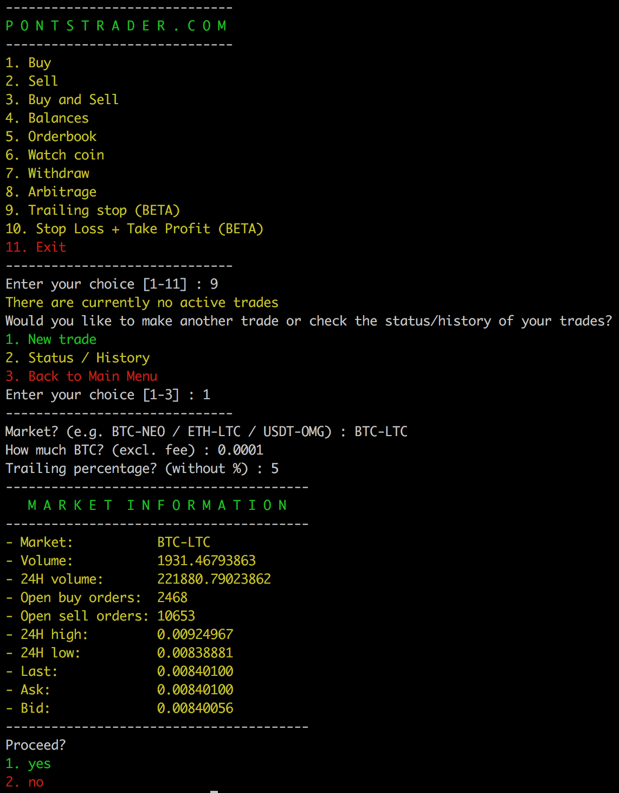
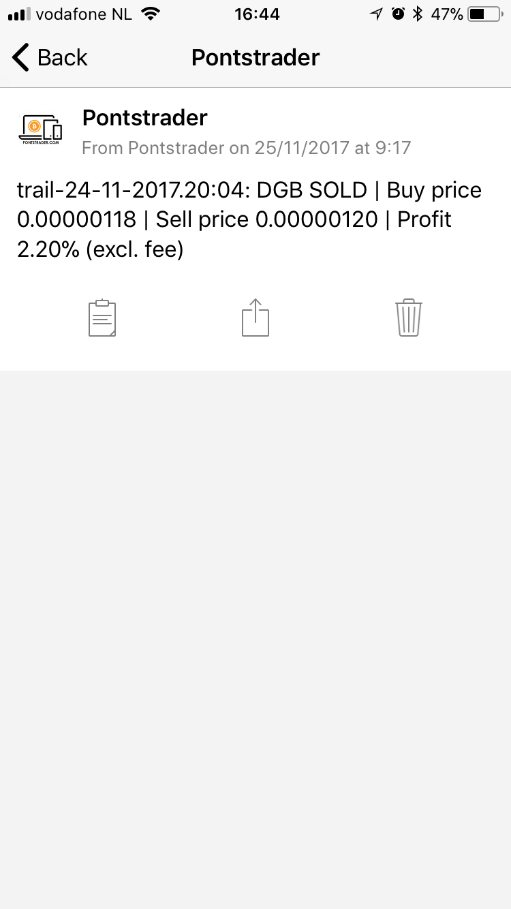

#### 10. Take Profit (Requires 24/7 running device)
The take profit function is actually the same as the Sell option, only the difference is that this script will keep track of the sell and notify you by a push message when the sell have happend.

Because the script is keeping track of the sell, you will need to run this on a device which is on 24/7.

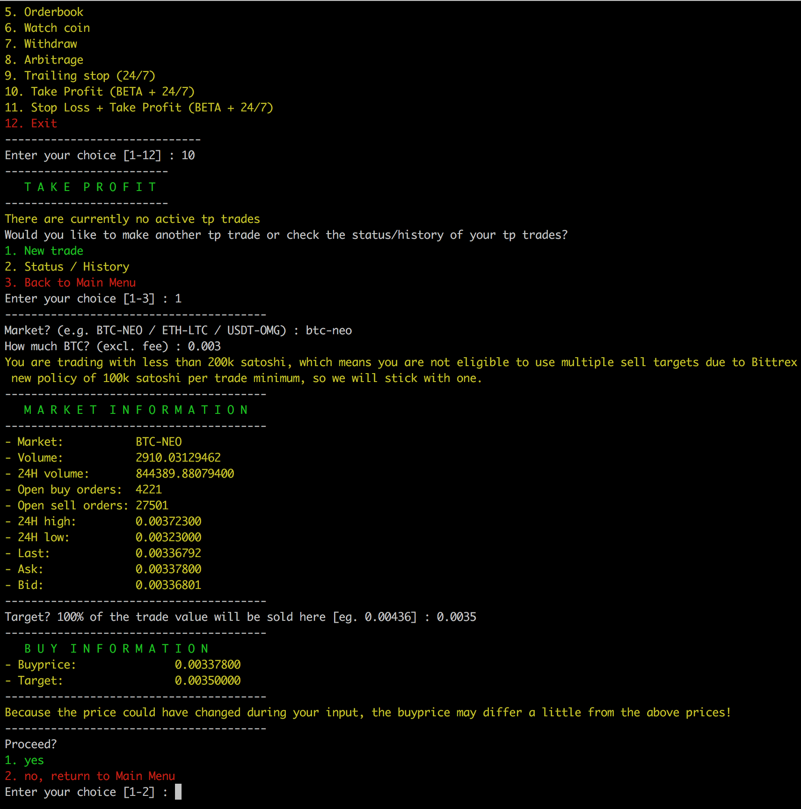
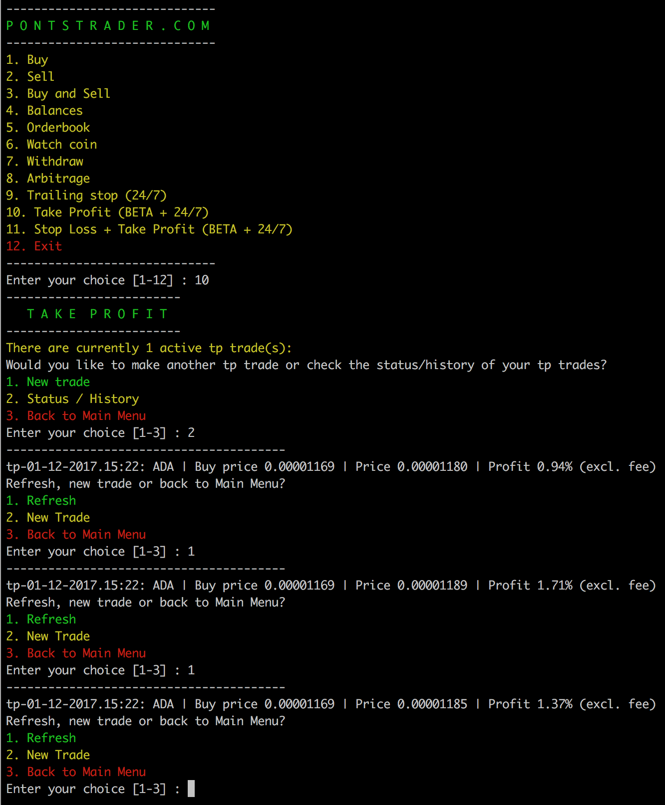

#### 11. Stop Loss + Take Profit (Requires 24/7 running device)
The take profit function is actually the same as the Sell option, including a stop loss function which allows you to set not only one but both of them.

Same as the other 24/7 functions this function will notify you on changes through a push message.

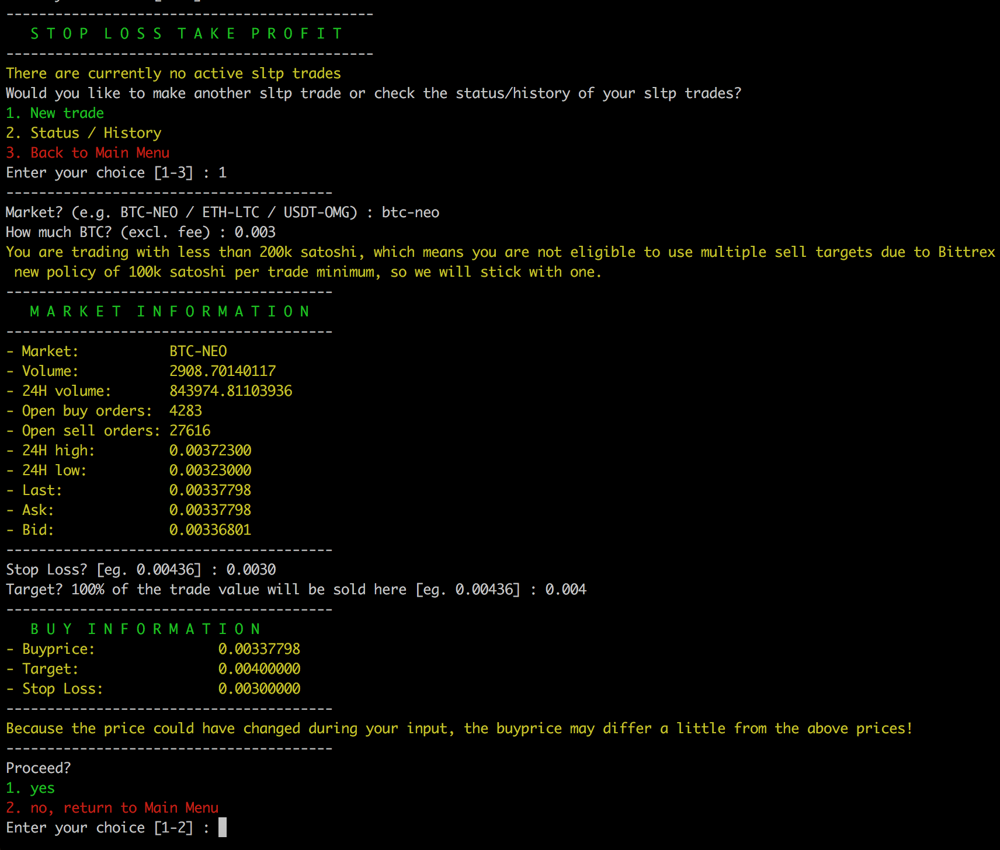
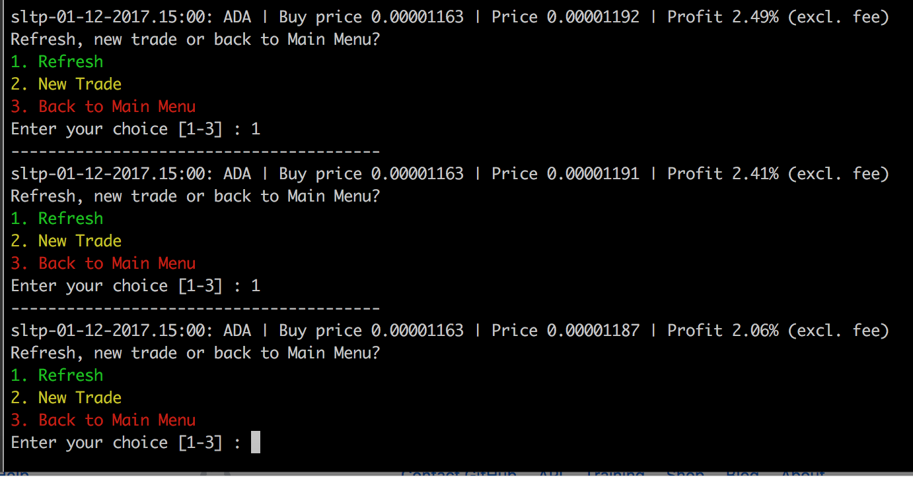

#### 12. Trailing + Take Profit (Requires 24/7 running device)
This function is the same as the trailing stop loss function, the only difference is... is that this function will never ever sell your coin when its down, it will only trigger a sell when the trailing stop loss threshold is in profit.

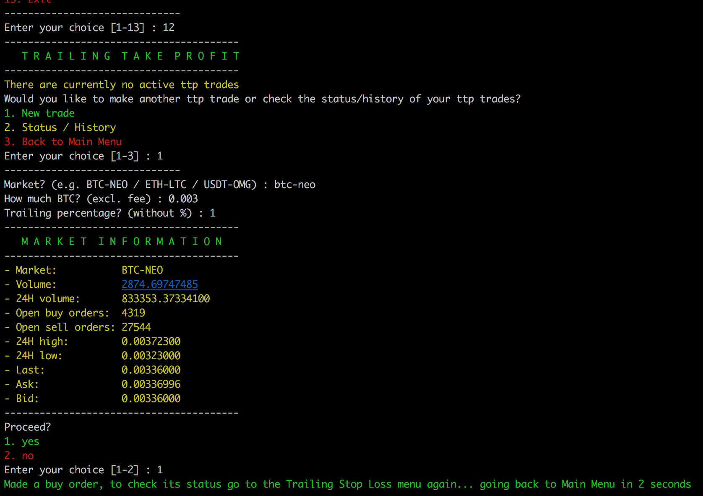
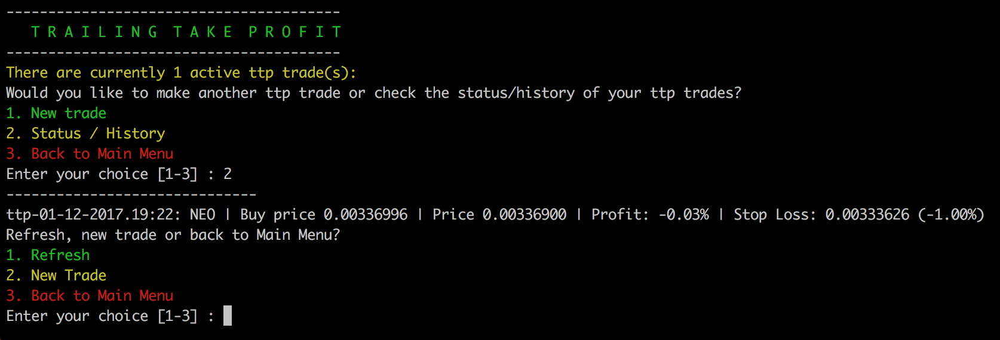

Join us on Telegram for more information or if you would like to purchase pontstrader for just 10 dollar:
https://t.me/pontstrader
